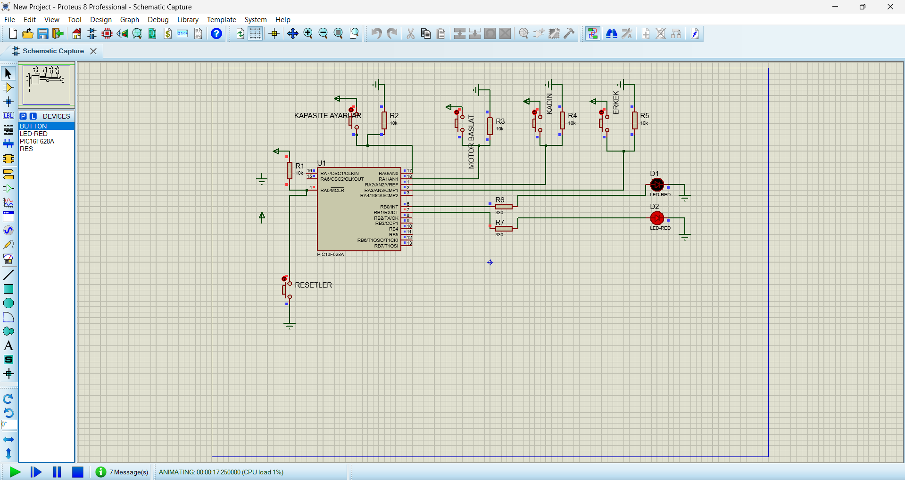

## Simulation

# PIC16F628A Production Line Control

Production line control system using PIC16F628A (Assembly & Proteus)

## Project Description

This project is a production line control system developed using the PIC16F628A microcontroller.

The system is designed for a production process with two separate lines. Each line counts the produced items using sensor inputs. The package capacity is selected by the user before starting the production process.

When one production line reaches the selected capacity, the related motor stops automatically. The system can be restarted using the reset input.

---

## ⚙️ Features

- Package capacity selection using button input
- Two separate production line control
- Product counting with sensor inputs
- Automatic motor stop when the selected capacity is reached
- Independent control of two production lines
- Reset-based restart logic
- Proteus circuit simulation

---

## Working Logic

- RA0 → Package capacity selection button
- RA1 → Start / confirm button
- RA2 → Sensor input for first production line
- RA3 → Sensor input for second production line
- RB0 → First motor output
- RB1 → Second motor output
- RA5 / MCLR → Reset input

- The user selects the package capacity by pressing the RA0 button.
- After the capacity is confirmed with RA1, the production process starts.
- RA2 and RA3 are used as sensor inputs to count products on each line.
- RB0 and RB1 control the motors of the production lines.
- When a production line reaches the selected package capacity:
  - The related motor stops automatically
  - The other line can continue working until it reaches the same capacity
- The system can be restarted using the reset input.

---

## Technologies Used

- PIC16F628A
- Assembly (MPASM)
- MPLAB X IDE
- Proteus

---

## ▶️ How to Run

1. Open the Proteus project file
2. Load the `.hex` file into PIC16F628A
3. Start the simulation
4. Set the package capacity using the RA0 button
5. Confirm and start the production process using RA1
6. Use RA2 and RA3 inputs to simulate product detection
7. Observe the motor outputs on RB0 and RB1

---

## Project Structure

- `code/` → Assembly source code
- `hex/` → Compiled HEX file
- `proteus/` → Proteus simulation file
